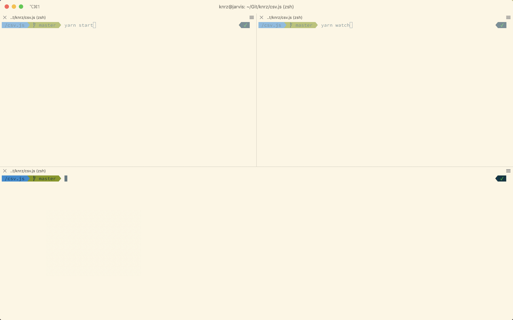
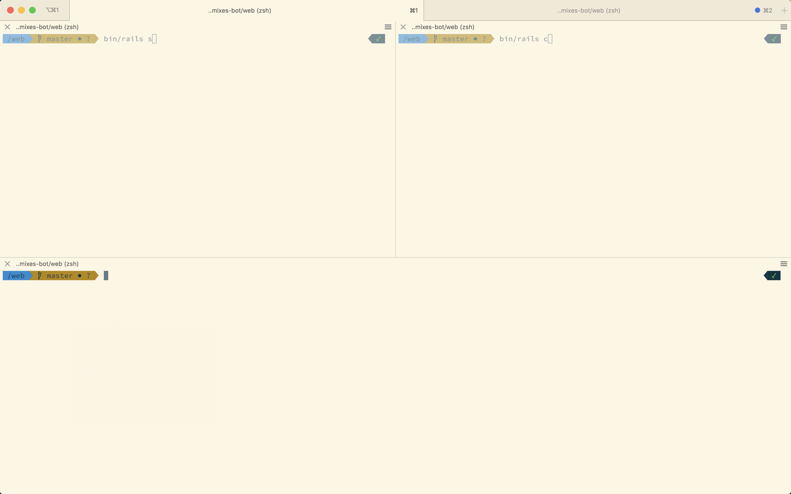
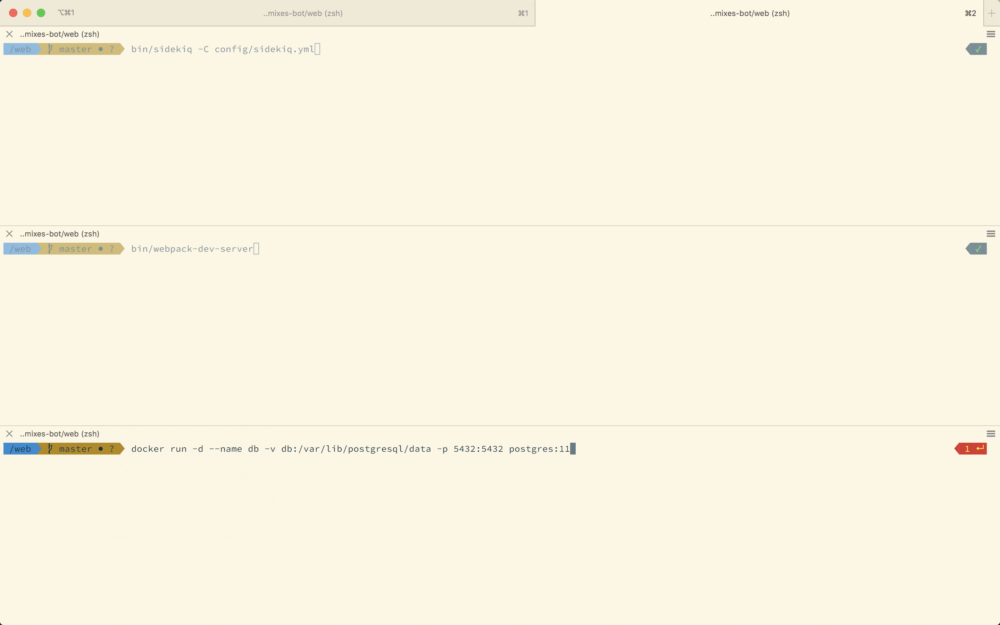

# iterm-workspace

**Configuration-based iTerm scripting for starting up your project workspace.**

Frequently, you'll run into a situation where you have to run multiple programs in your terminal to get your project running.

Imagine this:

You get to work, turn on your computer, fire up VS Code, and are ready to get working. You open up your terminal program, `cd` into the project directory. Now which commands are you supposed to run? Maybe you have JavaScript compilation, maybe you have a development server, and a job runner, and you're running a Docker database container by hand.

**What if there was an _easy_ way to run all of those instantly in tabs and panes?**

## Getting Started

0. [Set iTerm to preserve working directory when splitting panes](https://apple.stackexchange.com/questions/337377/iterm2-split-vertically-with-current-profile-with-same-working-directory).
1. `brew tap knrz/iterm-workspace && brew install iterm-workspace` (Alternatively, clone this repo and add it to your `PATH`)
2. Run `start-iterm-workspace` in your project directory to initialize a configuration file
3. Step by step, develop and test your desired workspace configuration.
4. Run `start-iterm-workspace` to launch your workspace

Let's look at a sample configuration file for a JavaScript project.

## JavaScript Project Example

```json
{
  "tabs": [
    {
      "commands": [
        ["yarn start", "yarn watch"],
        ""
      ]
    }
  ]
}
```

Running `start-iterm-workspace` with the configuration above results in the following setup, and it will run both `yarn start` and `yarn watch`.

**Hint** Try to see the visual relationship between the commands array, as formatted, and the result below.



Notice that `["yarn start", "yarn watch"]` corresponds to the two panes at the top, and the empty command `""` corresponds to the bottom pane.

## A More Complicated Example

Let's say you're working on a Rails project. The configuration below is exactly like the JavaScript project configuration.

```json
{
  "tabs": [
    {
      "commands": [
        ["bin/rails s", "bin/rails c"],
        ""
      ]
    }
  ]
}
```

Often, you'll want to run auxiliary programs, like a background job runner, webpack, and because you're cool you're running your PostgreSQL instance using Docker.

Let's augment our configuration file to also run these programs.

```json
{
  "tabs": [
    {
      "commands": [
        ["bin/rails s", "bin/rails c"],
        ""
      ]
    },
    {
      "commands": [
        "bin/sidekiq -C config/sidekiq.yml",
        "bin/webpack-dev-server",
        "docker run -d --name db -v db:/var/lib/postgresql/data -p 5432:5432 postgres:11",
      ]
    }
  ]
}
```

**Hint** Look for the visual relationship between the commands arrays, as formatted, and the result of running `start-iterm-workspace` below.

_The First Tab_


_The Second Tab_


## Is it any good?

Absolutely.

## Notes

### As many panes as you want

`iterm-workspace` accepts arbitrarily nested arrays for commands; it will recursively split panes to run those commands. Give it a try, and you'll see for yourself.

### Running Multiple Commands in a Single Pane

Currently, each command can only be 1 string. If you need to chain commands, I would recommend doing so with `&&` or `;`, as appropriate. (e.g. `cd /path/to/project && yarn start`).

## Copyright and License

Copyright (c) 2019, Kash Nouroozi.

The source code is licensed under the [MIT License](LICENSE).
